<!--
  Perfil de GitHub · estilo "dev nocturno" ☕
  Los SVG de assets/ los genera scripts/build_profile.py a partir de profile.json.
  Para cambiar textos, repos destacados o decoraciones edita profile.json (ver PERSONALIZAR.md).
-->

  <a href="https://github.com/cajacuenta767-sketch">
    
  </a>

  <h1>Bryan Salirrosas</h1>
  

    <b>Hide777</b> · <b>@cajacuenta767-sketch</b> 
    Full stack developer · Software architect&nbsp;|&nbsp;coffee addict ☕
  

  

    📍 La Paz, Bolivia
    &nbsp;·&nbsp; 🎓 Ingeniería de Sistemas, UMSA
    &nbsp;·&nbsp; <a href="https://hide-dev.vercel.app/proyectos">🌐 Portafolio</a>
    &nbsp;·&nbsp; <a href="mailto:salirrosasbryan18@gmail.com">✉️ Email</a>
  

  <a href="https://github.com/cajacuenta767-sketch?tab=followers">
    
  </a>

  <a href="https://github.com/cajacuenta767-sketch"><b>Overview</b></a>
  &nbsp;·&nbsp;
  <a href="https://github.com/cajacuenta767-sketch?tab=repositories">Repositorios</a>
  &nbsp;·&nbsp;
  <a href="https://github.com/cajacuenta767-sketch?tab=projects">Proyectos</a>
  &nbsp;·&nbsp;
  <a href="https://github.com/cajacuenta767-sketch?tab=stars">Stars</a>

  Founder &amp; Lead Software Architect en <b>Sky tech</b>: diseño ERPs, MVPs y pipelines de datos para empresas y educación.
  Me interesan las arquitecturas de microservicios, el cloud, la ciberseguridad y la automatización empresarial.
  Español nativo · Inglés técnico.

<h3>🧰 Stack</h3>

  

<h3>📌 Repositorios destacados &nbsp;<a href="https://github.com/cajacuenta767-sketch?tab=repositories">Ver todos</a></h3>

  <a href="https://github.com/cajacuenta767-sketch/Avendia-3.0"></a>
  <a href="https://github.com/cajacuenta767-sketch/Supero-Pos"></a>
  <a href="https://github.com/cajacuenta767-sketch/Vendly"></a>
  <a href="https://github.com/cajacuenta767-sketch/Tienda-Online-"></a>
  <a href="https://github.com/cajacuenta767-sketch/rafael.net"></a>
  <a href="https://github.com/cajacuenta767-sketch/Farmasys-"></a>

<h3>💼 Experiencia</h3>

  

<h3>🎓 Formación y logros</h3>

  

<h3>🌱 Contribuciones</h3>

  <a href="https://github.com/cajacuenta767-sketch">
    
  </a>

  while (alive) { code(); coffee(); } &nbsp;·&nbsp; las tarjetas se actualizan solas cada día con GitHub Actions ✦

